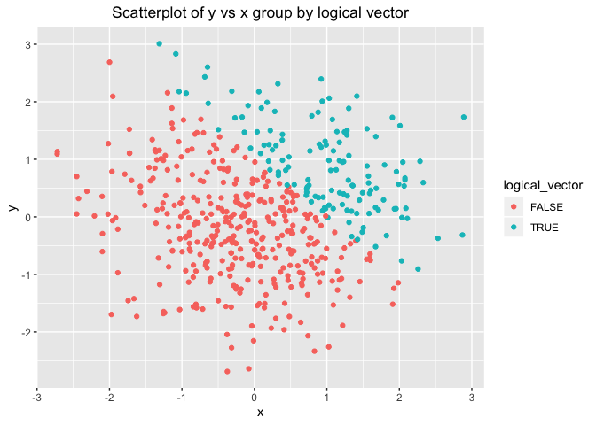
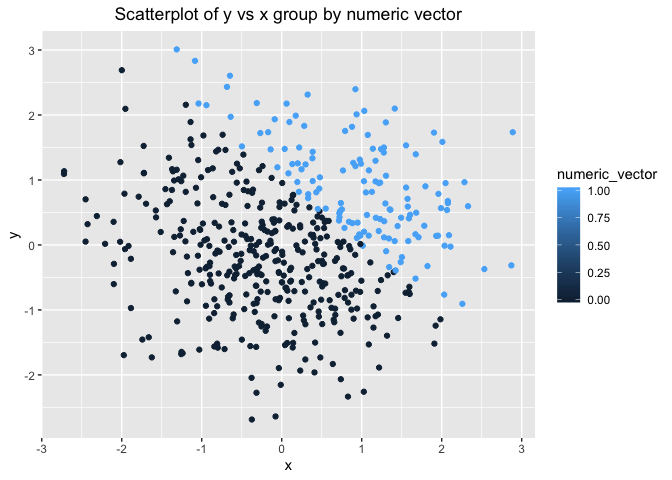

p8105\_hw1\_jz3183
================
Jungang Zou
9/18/2019

# Homework 1 for Data Science Course p8105

This is an R Markdown document for homework 1 in course p8105. The
author is Jungang Zou whose UNI is jz3183.

## Problem 1

``` r
# create the data frame
df_p1 <- tibble(
  random_sample = rnorm(8),
  logical_vector = random_sample > 0,
  character_vector = c("a","b","c","d","e","f","g","h"),
  factor_vector = factor(c("class_1","class_3","class_2","class_1","class_2","class_3","class_1","class_2"), 
                         levels = c("class_1","class_2","class_3"))
)

# display the data frame
df_p1
## # A tibble: 8 x 4
##   random_sample logical_vector character_vector factor_vector
##           <dbl> <lgl>          <chr>            <fct>        
## 1        -0.626 FALSE          a                class_1      
## 2         0.184 TRUE           b                class_3      
## 3        -0.836 FALSE          c                class_2      
## 4         1.60  TRUE           d                class_1      
## 5         0.330 TRUE           e                class_2      
## 6        -0.820 FALSE          f                class_3      
## 7         0.487 TRUE           g                class_1      
## 8         0.738 TRUE           h                class_2
```

Calculate the mean of each variable in dataframe df\_p1. The results are
as follows:

  - The mean of random\_sample is 0.1314544.
  - The mean of logical\_vector is 0.625.
  - The mean of character\_vector is NA.
  - The mean of factor\_vector is NA.

The reason why the mean of character\_vector and factor\_vector is NA,
is that the function of mean can not be applied to the data whose type
is character vector or factor vector.

The next code chunk is to test the as.number() function and some
explanation will be used to explain the results.

``` r
as.numeric(pull(df_p1, random_sample))    # convert numeric to numeric
as.numeric(pull(df_p1, logical_vector))   # convert logical to numeric
as.numeric(pull(df_p1, character_vector)) # convert character to numeric
## Warning: 强制改变过程中产生了NA
as.numeric(pull(df_p1, factor_vector))    # convert factor to numeric
```

Actually, the function as.number is used to convert other data type to
double float number.

  - For numeric data, it keeps the same data type.
  - For logical data, it converts TRUE to 1, and FALSE to 0.
  - For character data, it doesn\`t work.
  - For factor data, it converts the factor to number referring to
    factor levels. This process makes the factor data meaningless.

Since the function of mean() whose parameter only can be numeric or
logical, so it can not be applied to other type of data.

The next code chunk is to test different convertion among logical vector
and different data
types.

``` r
as.numeric(pull(df_p1, logical_vector)) * pull(df_p1, random_sample)            # convert numeric to numeric and multiplication
## [1] 0.0000000 0.1836433 0.0000000 1.5952808 0.3295078 0.0000000 0.4874291
## [8] 0.7383247

as.factor(pull(df_p1, logical_vector)) * pull(df_p1, random_sample)             # convert logical to numeric and multiplication
## [1] NA NA NA NA NA NA NA NA

as.numeric(as.factor(pull(df_p1, logical_vector))) * pull(df_p1, random_sample) # convert factor to numeric and multiplication
## [1] -0.6264538  0.3672866 -0.8356286  3.1905616  0.6590155 -0.8204684
## [7]  0.9748581  1.4766494
```

As we can see, multiplication is not meaningful for factor.

## Problem 2

``` r
# create the data frame
df_p2 <- tibble(
  x = rnorm(500),
  y = rnorm(500),
  logical_vector = (x + y) > 1,
  numeric_vector = as.numeric(logical_vector),
  factor_vector = as.factor(logical_vector)
)

# display the data frame
df_p2
## # A tibble: 500 x 5
##          x      y logical_vector numeric_vector factor_vector
##      <dbl>  <dbl> <lgl>                   <dbl> <fct>        
##  1 -0.897  -0.460 FALSE                       0 FALSE        
##  2  0.185   0.618 FALSE                       0 FALSE        
##  3  1.59   -0.720 FALSE                       0 FALSE        
##  4 -1.13   -0.584 FALSE                       0 FALSE        
##  5 -0.0803  0.216 FALSE                       0 FALSE        
##  6  0.132   1.24  TRUE                        1 TRUE         
##  7  0.708  -0.768 FALSE                       0 FALSE        
##  8 -0.240   1.21  FALSE                       0 FALSE        
##  9  1.98   -1.14  FALSE                       0 FALSE        
## 10 -0.139   1.47  TRUE                        1 TRUE         
## # … with 490 more rows
```

There is a short description for these vectors:

  - the size of the dataset is (500, 5).
  - the mean of x is 0.0616923, median of x is 0.0439172, and standard
    deviation of x is 1.0323776.
  - the proportion of cases for which x + y \> 1 is 0.266.

The next code chunk is used to plot some graphs by ggplot

``` r
# scatterplot of y vs x group by logical vector
first_graph <- ggplot(df_p2, aes(x = x, y = y, color = logical_vector)) + geom_point() + labs(title = "Scatterplot of y vs x group by logical vector", x = "x", y = "y") + theme(plot.title = element_text(hjust = 0.5))
first_graph
```

<!-- -->

``` r

# scatterplot of y vs x group by numeric vector
second_graph <- ggplot(df_p2, aes(x = x, y = y, color = numeric_vector)) + geom_point() + labs(title = "Scatterplot of y vs x group by numeric vector", x = "x", y = "y") + theme(plot.title = element_text(hjust = 0.5))
second_graph
```

<!-- -->

``` r

# scatterplot of y vs x group by factor vector
third_graph <- ggplot(df_p2, aes(x = x, y = y, color = factor_vector)) + geom_point() + labs(title = "Scatterplot of y vs x group by factor vector", x = "x", y = "y") + theme(plot.title = element_text(hjust = 0.5))
third_graph
```

<!-- -->

As we know, since x and y are all from stardard normal distribution, so
the mean of x is 0 and the mean of y is 0. From this, the mean of x + y
is also 0, so the number of x + y \<= 1 is greater than x + y \> 1. This
is the reason why the number of FALSE point is greater than the number
of TRUE points in the first scatterplot.

As for the second and third scatterplots, the same reasons hold. So in
the second scatterplot, the number of 0 point is greater than the number
of 1 point. And in the third scatterplot, the number of FALSE Factor
point is greater than the number of TRUE Factor point.

Finally, we saved the first scatterplot by running

``` r
# save the first scatterplot
ggsave("first_scatterplot.pdf", first_graph, height = 4, width = 6)
```
